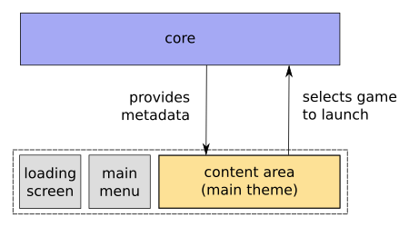

# Theme guide

## Overview

Pegasus consists of two layers: the **core** which looks for your games and metadata, and the **user interface** (UI), where the data provided by the core can be presented in some form. The two layers are completely separated, which means you have full control about what you put on the screen, where you place assets or text and what kind of animations or effects you use on them.



Themes in Pegasus define the look and feel of the whole "content area". You can use same style for all platforms and games, or you can decide to change the UI dynamically (eg. based on the selected platform or the current time).


## QML

Themes are written in the **QML** language. QML (Qt Modeling Language) is a user interface specification language: it describes the components of the themes, their properties, and the hierarchy and relations between them. Technically it's similar to XML, HTML and the JSON languages.

```qml
// An example QML document
// *QML documents describe an object tree of elements*
// Source: https://en.wikipedia.org/wiki/QML

import QtQuick 2.0

Rectangle {
    id: canvas
    width: 250
    height: 200
    color: "blue"

    Image {
        id: logo
        source: "pics/logo.png"
        anchors.centerIn: parent
        x: canvas.height / 5
    }
}
```

There are numerous built-in components you can use in a theme: simple types (texts, rectangles, images, ...), components that define layouts of other items (rows, grids, custom paths) and special elements (animations, particle effects, custom shader code). We'll see the most common of them and their usage later in this guide.

&nbsp;

QML generally describes *what* is on the screen and how they *look* like -- to tell what a component should *do*, you can extend QML with **JavaScript** code. Don't worry if you aren't familiar with it; QML works quite well on its own, usually you only need to code if you want to implement some special behaviour for the elements.

!!! warning
    While JavaScript is usually associated with websites, Pegasus is **NOT** a web browser or an HTML5 app. Only the JavaScript engine is used, not a whole browser. In case you're worried about performance: your script will automatically get compiled to native code the next time you start Pegasus when you change a file.

&nbsp;

!!! info "Further reading"
    - [https://en.wikipedia.org/wiki/QML](https://en.wikipedia.org/wiki/QML)
    - [https://doc.qt.io/qt-5/qtquick-index.html](https://doc.qt.io/qt-5/qtquick-index.html)
    - [https://doc.qt.io/qt-5/qmlapplications.html](https://doc.qt.io/qt-5/qmlapplications.html)


## Theme files

Pegasus is looking for themes in the following directories:

**All platforms:**

- `[directory of the program]/themes`
- `[INSTALL_DATADIR]/themes` (only if defined during a [manual build](../dev/build.md))

**Linux:**

- `~/.config/pegasus-frontend/themes`
- `~/.local/share/pegasus-frontend/themes`
- `/etc/xdg/pegasus-frontend/themes`
- `/usr/local/share/pegasus-frontend/themes`
- `/usr/share/pegasus-frontend/themes`

**Windows:**

- `C:/Users/[user name]/AppData/Local/pegasus-frontend/themes`
- `C:/ProgramData/pegasus-frontend/themes`

**macOS:**

- `~/Library/Preferences/pegasus-frontend/themes`
- `~/Library/Application Support/pegasus-frontend/themes`
- `/Library/Application Support/pegasus-frontend/themes`

Inside these directories, every individual theme is contained in its own directory. The name of this directory doesn't matter, as long as it's unique.

Two files are required for every theme: a **theme.cfg** file that contains information about your theme, like name or description, and a **theme.qml** which will be the entry point to your QML code (ie. this will be loaded by Pegasus).

### theme.cfg

The `theme.cfg` file is used to describe your theme. It's a simple configuration file, in the same format as Pegasus' game metadata files (*todo*). In short:

- `option name: option value` define options
- `[words between brackets]` define groups of options (at the moment they are not used in these files though)
- empty lines and lines starting with `#` (comments) are skipped
- lines starting with space(s) will be appended to the previous option's value (whics you can use for eg. descriptions spanning multiple lines)

Here is an example:

```control
name: Pegasus Grid
author: Mátyás Mustoha
version: alpha
summary: The default grid theme of Pegasus
```

Currently the following options are recognized:

- `name`: the name of your theme (required). Should be short and unique.
- `version`: a version identifier; can be a number, text, whatever you like as long as it's unique.
- `author`: the author of the theme; either simply a name or in "name <email>" format.
- `summary`: a short (max. 80-100 characters) summary.
- `description`: a longer description.
- `keywords`: keywords used for searching. Separate words with `,`.
- `homepage`: a link to you project's site.

Every theme is required to have a `theme.cfg` file, with at least the `name` defined.


#### WIP section

These components are contained in so called *modules*; you'll see that most of them are in the one called **Qt Quick**. There are others: for example audio and video playback are in Qt Multimedia. In every case, I'll list the module in which the type can be found in this guide, and you can also

On the user interface side, there are three main components: the loading screen you see when you launch Pegasus, the main menu overlay and the content area, of which this guide will be about.
