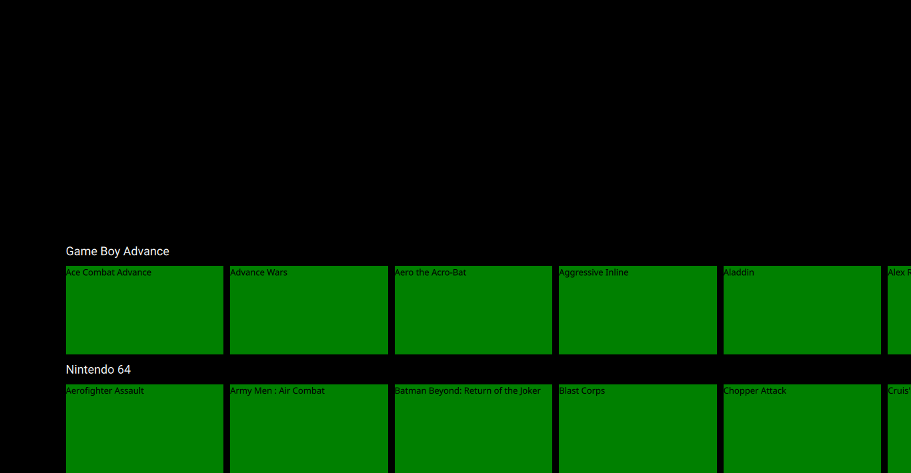

# Flixnet theme, Part 3: Using API data

Finally, the time has come to replace the placeholder elements with actual content. Let's start by using the real collection data. According to the [API reference](api.md), collections can be accessed and selected through `api.collections`, which we can use as the `model` of a ListView (or any other View).

## Vertical axis

First, find the ListView for the collection axis and change its `model` property:

```qml hl_lines="6"
ListView {
    id: collectionAxis

    // ...

    model: api.collections
    delegate: collectionAxisDelegate

    // ...
}
```

Previously the `model` was set to `10`, and so the `modelData` available in the delegates was a number between 0 and 9. With `model` set to `api.collections`, the `modelData` will be a <a href="../api/#collections" target="_blank">`Collection` object</a>.

A `Collection` always has a `name`, so let's show that:

```qml hl_lines="10"
Component {
    id: collectionAxisDelegate

    Item {
        // ...

        Text {
            id: label

            text: modelData.name
            color: "white"
            font.pixelSize: vpx(18)
            font.family: globalFonts.sans

            // ...
        }

        ListView {
            id: gameAxis

            // ...
        }
    }
}
```

!!! tip
    If the name of the `modelData` property you use (in this case `name`) don't collide with other properties of the object, it's not required to type out `modelData`: you can simply write `text: name`.

After a refresh, you should see the names of collections appearing in Pegasus.


## Horizontal axis

Now let's show the game titles in the horizontal rectangles. Every `Collection` has a `games` member that holds list of games associated with the collection. Let's use it in the horizontal axis (`collectionAxisDelegate`):

```qml hl_lines="18"
Component {
    id: collectionAxisDelegate

    Item {
        // ...

        Text {
            id: label

            // ...
        }

        ListView {
            id: gameAxis

            // ...

            model: modelData.games
            delegate: gameAxisDelegate
            spacing: vpx(10)

            // ...
        }
    }
}
```

And now the Views scroll properly, with the real data!

## Game items

With the previous changes, `gameAxisDelegate` is now a visual representation for a Game element. A Game always has a `title`, so we can simply set it as the text:

```qml hl_lines="11"
Component {
    id: gameAxisDelegate

    Rectangle {
        width: vpx(240)
        height: vpx(135)

        color: "green"

        Text {
            text: modelData.title
        }
    }
}
```

!!! help
    The `model` of the *vertical* ListView was a list of `Collection`s, so the `modelData` received by a delegate of that ListView (one whole horizontal row) is one `Collection` object.

    The `model` of these *horizontal* ListViews is a list of `Game`s, so a delegate of the horizontal ListViews will see a `Game` in its `modelData`.

And now the game names also show up in Pegasus:



## Launching games

Now that the game selection items are in sync with the API, we can actually launch games! To launch a game, we just have to call its `launch()` function. Let's make it so when ++return++ is pressed the current game is launched:

```qml hl_lines="9"
ListView {
    id: collectionAxis

    // ...

    focus: true
    Keys.onLeftPressed: currentItem.axis.decrementCurrentIndex()
    Keys.onRightPressed: currentItem.axis.incrementCurrentIndex()
    Keys.onReturnPressed: ???.launch()
}
```

Hm, but how do we access that game in the first place? All Views have a `currentIndex` property that tells us which item is currently selected, and we can use this with the <a href="../api/#item-models" target="_blank">`get()` function</a> available in the models that come from the API.

The *current game* is the currently selected game of the currently selected collection, which we can write like this:

```qml
Keys.onReturnPressed: api.collections.get(currentIndex).games.get(currentItem.currentIndex).launch()
```

Which, while works, is a tiny bit long to type out. To make things simpler, let's add a `currentGame` field to the game axis:

```qml hl_lines="9"
ListView {
    id: gameAxis

    property var currentGame: modelData.games.get(currentIndex) // or just 'model.get(...)'

    // ...
```

With that, we can reduce the line to just this:

```qml hl_lines="3"
Keys.onLeftPressed: currentItem.axis.decrementCurrentIndex()
Keys.onRightPressed: currentItem.axis.incrementCurrentIndex()
Keys.onReturnPressed: currentItem.axis.currentGame.launch()
```

Looks better (well, at least to me, your mileage may vary).

!!! help
    Careful not to confuse the `onReturnPressed` and `onEnterPressed` calls: technically `Return` is the key next to the letters, while `Enter` is the one on the numeric keypad.

And with this, technically our theme is fully functional!


## Gamepads and custom configurations

Now you might wonder, "how can I make it work with a gamepad?" or "what if I changed the keyboard layout?". We want to launch the game when any key or button set for "accepting things" is pressed. For this we can add a general input check using `Keys.onPressed`, and test whether this key/button press event is recognized using the keys-related <a href="../api/#keys" target="_blank">API functions</a>:

```qml hl_lines="3 4 5 6"
Keys.onLeftPressed: currentItem.axis.decrementCurrentIndex()
Keys.onRightPressed: currentItem.axis.incrementCurrentIndex()
Keys.onPressed: {
    if (api.keys.isAccept(event))
        currentItem.axis.currentGame.launch();
}
```


With all that, navigation should now work well in our theme. Next step, let's make it pretty!


## The code so far

??? note "The code so far"
        :::qml
        import QtQuick 2.0

        FocusScope {

            ListView {
                id: collectionAxis

                anchors.left: parent.left
                anchors.right: parent.right
                anchors.top: parent.verticalCenter
                anchors.bottom: parent.bottom

                model: api.collections
                delegate: collectionAxisDelegate

                snapMode: ListView.SnapOneItem
                highlightRangeMode: ListView.StrictlyEnforceRange
                clip: true

                focus: true
                Keys.onLeftPressed: currentItem.axis.decrementCurrentIndex()
                Keys.onRightPressed: currentItem.axis.incrementCurrentIndex()
                Keys.onPressed: {
                    if (api.keys.isAccept(event))
                        currentItem.axis.currentGame.launch();
                }
            }

            Component {
                id: collectionAxisDelegate

                Item {

                    width: ListView.view.width
                    height: vpx(180)

                    Text {
                        id: label

                        text: modelData.name
                        color: "white"
                        font.pixelSize: vpx(18)
                        font.family: globalFonts.sans

                        height: vpx(45)
                        verticalAlignment: Text.AlignVCenter

                        anchors.left: parent.left
                        anchors.leftMargin: vpx(100)
                    }

                    ListView {
                        id: gameAxis

                        property var currentGame: modelData.games.get(currentIndex)

                        anchors.left: parent.left
                        anchors.right: parent.right
                        anchors.top: label.bottom
                        anchors.bottom: parent.bottom

                        orientation: ListView.Horizontal

                        model: modelData.gameList.model
                        currentIndex: modelData.gameList.index
                        delegate: gameAxisDelegate
                        spacing: vpx(10)

                        snapMode: ListView.SnapOneItem
                        highlightRangeMode: ListView.StrictlyEnforceRange

                        preferredHighlightBegin: vpx(100)
                        preferredHighlightEnd: preferredHighlightBegin + vpx(240)
                    }
                }
            }

            Component {
                id: gameAxisDelegate

                Rectangle {
                    width: vpx(240)
                    height: vpx(135)

                    color: "green"

                    Text {
                        text: modelData.title
                    }
                }
            }

        }
